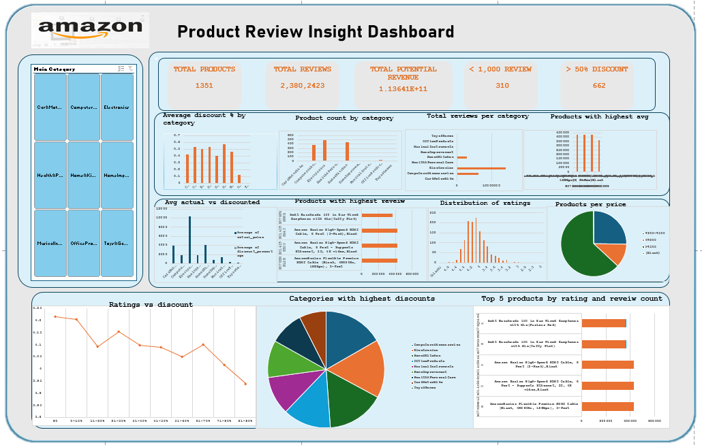

# DSA-PROJECT-

# Amazon Product Review Analysis

## Project Overview

This project was completed as part of the learning requirements in the Data Analytics track at Digital Skillup Africa (DSA). The goal was to perform an end-to-end analysis on a dataset containing product and customer review information from Amazon. The task involved cleaning raw data, deriving insights using Microsoft Excel calculations and pivot tables, and presenting the findings in a structured, interactive Excel dashboard. 

---

## Dataset

- **Rows:** 1,465 products  
- **Fields:** 16 columns, including product name, category, price, ratings, reviews, and discount

---

## Analysis Tasks

1. Average discount % by category
2. Product count per category
3. Total number of reviews per category
4. Products with highest average ratings
5. Average actual vs discounted price by category
6. Top reviewed products
7. Products with 50%+ discount
8. Rating distribution
9. Potential revenue by category
10. Price bucket distribution
11. Relationship between ratings and discounts
12. Products with <1,000 reviews
13. Categories with highest discounts
14. Top 5 products (ratings + reviews)

---

## Tools Used

- Microsoft Excel (Formulas, Pivot Tables, Charts, Dashboard)
- Excel Slicers and Conditional Formatting

---

## 📈 Dashboard

The final dashboard summarizes the key insights and visualizations from the analysis:
- Cards (KPIs)
- Bar and Column Charts
- Pie Chart (for rating distribution)
- Slicers for filtering by category

---

##  Insights & Recommendations

- Focus marketing on ₹200–₹500 products with good ratings
- Offer 30–60% discounts for best visibility
- Improve quality on low-rated discounted products
- Encourage reviews for less-reviewed products

---

## Files

- `Amazon_Review_Analysis.xlsx` – Full workbook with data cleaning, pivot tables, and dashboard
- `dashboard_screenshot.png` – Dashboard preview 

## Dashboard



---


# KMS SQL Case Study – Business Intelligence Report (2009–2012)

## Project Overview

This project explores sales and operational data for Kultra Mega Stores (KMS), a Lagos-based company that supplies office furniture and equipment. As a Business Intelligence Analyst supporting the Abuja division, I used SQL to analyze customer orders and shipping activity between 2009 and 2012. The goal was to uncover insights that would help management improve customer engagement, boost revenue, and reduce operational costs.

---


## Tool Used
**SQL Server Management Studio (SSMS)**
- Objective: Answer key business questions using SQL, provide actionable recommendations to management.

---

## Analysis Task


### 1. Which product category had the highest sales?
```sql
SELECT Product_Category, 
       SUM(sales) AS TotalSales
FROM KMS_Sql
GROUP BY Product_Category
ORDER BY TotalSales DESC;
```

### 2. What are the Top 3 and Bottom 3 regions in terms of sales?
```sql
-- Top 3
SELECT TOP 3 Region, SUM(sales) AS TotalSales
FROM KMS_Sql
GROUP BY Region
ORDER BY TotalSales DESC;

-- Bottom 3
SELECT TOP 3 Region, SUM(sales) AS TotalSales
FROM KMS_Sql
GROUP BY Region
ORDER BY TotalSales ASC;
```

### 3. What were the total sales of appliances in Ontario?
```sql
SELECT SUM(sales) AS TotalAppliancesSales
FROM KMS_Sql
WHERE product_category = 'Appliances' AND region = 'Ontario';
```

### 4. Advice to increase revenue from bottom 10 customers
```sql
SELECT TOP 10 Customer_Name, SUM(sales) AS TotalSales
FROM KMS_Sql
GROUP BY Customer_Name
ORDER BY TotalSales ASC;
```
Advice: 
- Send targeted offers such as discounts, product bundles, or loyalty rewardd to stimulate new purchase
- Use personalized email campaigns to re-engage inactive customers
- Conduct customer feedback surveys to understand their experience and possible reasons for low enagagement
- Promote complementary products based on previous purchases to increase average order value

### 5. KMS incurred the most shipping cost using which shipping method?
```sql
SELECT Ship_Mode, SUM(Sales - Profit) AS EstimatedShippingCost
FROM KMS_Sql
GROUP BY Ship_Mode
ORDER BY EstimatedShippingCost DESC;
```

---

##  Case Scenerio II

### 6. Who are the most valuable customers and what do they typically purchase?
```sql
WITH TopCustomers AS (
    SELECT TOP 10 Customer_Name
    FROM KMS_Sql
    GROUP BY Customer_Name
    ORDER BY SUM(Sales) DESC
)
SELECT K.Customer_name, K.Product_Category, SUM(K.Sales) AS TotalSales
FROM KMS_Sql K
JOIN TopCustomers T
ON K.Customer_Name = T.Customer_Name
GROUP BY K.Customer_Name, K.Product_Category
ORDER BY K.Customer_Name, TotalSales DESC;
```

### 7. Which small business customer had the highest sales?
```sql
SELECT Customer_Name, SUM(Sales) AS TotalSales
FROM KMS_Sql
WHERE Segment = 'Small Business'
GROUP BY Customer_Name
ORDER BY TotalSales DESC;
```

### 8. Which corporate customer placed the most orders?
```sql
SELECT Customer_Name, COUNT(Order_ID) AS Order_Count
FROM KMS_Sql
WHERE segment = 'Corporate' AND Order_Date BETWEEN '2009-01-01' AND '2012-12-31'
GROUP BY Customer_Name
ORDER BY Order_Count DESC;
```

### 9. Which consumer customer was the most profitable?
```sql
SELECT Customer_Name, SUM(Profit) AS TotalProfit
FROM KMS_Sql
WHERE Segment = 'Consumer'
GROUP BY Customer_Name
ORDER BY TotalProfit DESC;
```

### 10. Which customer returned items, and what segment do they belong to?
```sql
SELECT DISTINCT K.Customer_Name, K.Segment
FROM KMS_Sql K
JOIN Order_Status O
ON K.Order_ID = O.Order_ID
WHERE O.Status = 'Returned';
```

### 11. Was shipping cost aligned with order priority?
```sql
SELECT 
    Order_Priority,
    Ship_Mode,
    COUNT(*) AS OrderCount,
    ROUND(SUM(Sales - Profit), 2) AS EstimatedShippingCost,
    AVG(DATEDIFF(day, Order_Date,Ship_Date)) AS AvgShipDays
FROM KMS_Sql
GROUP BY 
    Order_Priority, Ship_Mode
ORDER BY 
    Order_Priority, Ship_Mode;
```
Insight: 
- The data revealed that somehigh-priority orders correctly use fast shipping like Express Air
- Several low-priority orders also used the same expensive shipping method, resulting in unnecessary logistics costs.
- KMS should assure shipping modes align with order urgency eg using delivery truck for non urgent orders to save cost and regulary monitor shipping trends to ensurecompliance and cost efficiency


---

## Insight & Recommendations

- Customer re-engagement to boost revenue from low-performing customers  
- Align shipping methods with order urgency to optimize cost  
- Use sales trends to improve targeting and marketing efforts

---
## File
`DSA SQL PROJECT QUERY.sql`


